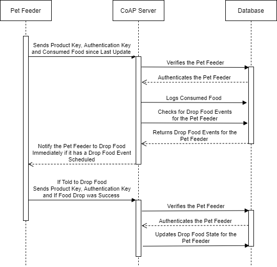

# CoAP Server

The CoAP server is frontend server for handling client requests from the pet feeders. Pet feeders send consumed food and dropped food statuses to the endpoint resource `coap://<server address of CoAP server/get_updates` (source code is located at [`endpoints/get_updates.py`](endpoints/get_updates.py)). Below is the sequence diagram showing the procedure of pet feeders logging events and the CoAP server communicating with the database using the Database API.



## Installation and Running the CoAP Server

First create a new Python 3.6 virtual environment to install the dependencies too. When the virtual environment is created, activate the virtual env and install the dependencies using the following command.

```pip install -r requirements.txt```

The Database API also has to be installed in the virtual env, which can be done by navigating to [the database_api folder](../database_api) and running the following command with the virtual env activated.

```python setup.py install```

To start the CoAP server just run the following command with the CoAP virtual environment activated that starts the server listening on the UDP port 5683.

```python server.py --log_level [the level of the logger eg. INFO]```
